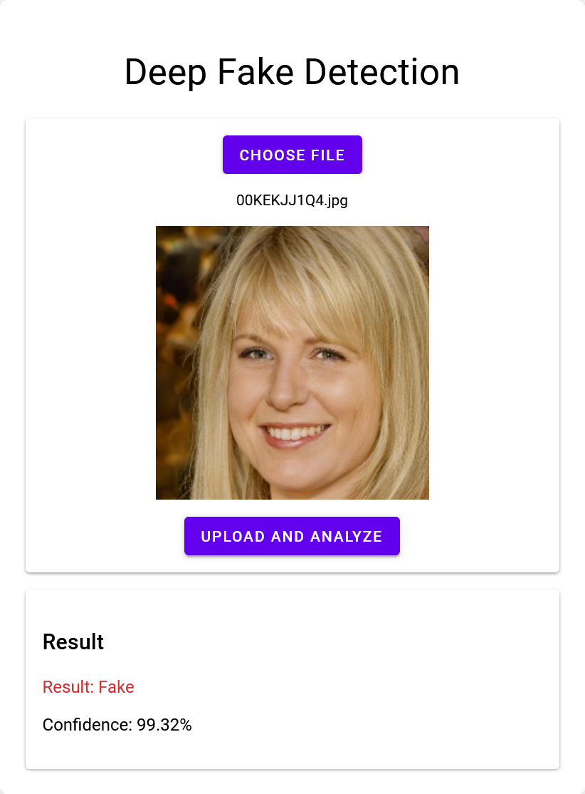

# Deep Fake Detection

This project implements a deep learning model to detect deep fake images. It includes a data preprocessing pipeline, model training scripts in a Jupyter notebook, and a Flask web application for easy deployment and usage.



## Project Structure

- `Detecting DeepFakes.ipynb`: Main Jupyter notebook for data preprocessing, model training, and evaluation (to be run in Google Colab)
- `app/app.py`: Flask web application for serving predictions
- `app/templates/index.html`: HTML template for the web interface
- `Dockerfile`: Instructions for building the Docker image

## Features

- Data loading and preprocessing from Kaggle dataset
- CNN model architecture for deep fake detection
- Data augmentation techniques
- Model training with learning rate scheduling
- Evaluation metrics and visualizations
- Flask web application for easy deployment
- Docker support for containerized deployment

## Prerequisites

- Google Colab account
- Kaggle account (for dataset access)
- Python 3.12+
- TensorFlow 2.x
- Flask
- OpenCV
- NumPy
- Matplotlib
- Seaborn
- Scikit-learn
- Docker (for containerized deployment)

## Installation

1. Clone this repository:
   ```
   git clone https://github.com/pouryare/deepfake-detection.git
   cd deepfake-detection
   ```

2. Open the `Detecting DeepFakes.ipynb` notebook in Google Colab.

3. Ensure you have a Kaggle account and API token set up. If not, follow these steps:
   - Create a Kaggle account at https://www.kaggle.com
   - Go to your account settings and create a new API token
   - Download the `kaggle.json` file

4. Upload the `kaggle.json` file to your Google Drive in the appropriate directory (as specified in the notebook).

## Usage

### Training the Model

1. Open the `Detecting DeepFakes.ipynb` notebook in Google Colab.
2. Run all cells in the notebook sequentially. This will:
   - Mount your Google Drive
   - Set up the Kaggle API
   - Download the dataset
   - Preprocess the images
   - Create and train the deep fake detection model
   - Evaluate the model and display performance metrics
   - Save the trained model

### Running the Web Application

#### Local Deployment

To run the Flask web application locally:

1. Ensure you have the required packages installed:
   ```
   pip install -r requirements.txt
   ```

2. Navigate to the `app` folder:
   ```
   cd app
   ```

3. Run the Flask app:
   ```
   python app.py
   ```

4. Open a web browser and go to `http://localhost:8080` to use the prediction interface.

#### Docker Deployment

You can deploy the web application using Docker in two ways:

1. Using the pre-built image from Docker Hub:
   ```
   docker pull pouryare/deepfake-detection:latest
   docker run -p 8080:8080 pouryare/deepfake-detection:latest
   ```

2. Building the image locally:
   ```
   docker build -t deepfake-detection .
   docker run -p 8080:8080 deepfake-detection
   ```

After running either of these commands, open a web browser and go to `http://localhost:8080` to use the prediction interface.

## Model Architecture

The project uses a Convolutional Neural Network (CNN) for deep fake detection. Detailed architecture information can be found in the `Detecting DeepFakes.ipynb` notebook.

## Performance

The model is evaluated using metrics such as accuracy, precision, recall, F1-score, and ROC curve. Detailed performance metrics and visualizations are generated during the evaluation phase in the Colab notebook.

## Contributing

Contributions to this project are welcome! Please fork the repository and submit a pull request with your proposed changes.

## License

This project is licensed under the MIT License - see the [LICENSE](LICENSE) file for details.

## Acknowledgments

- Dataset: [140k Real and Fake Faces](https://www.kaggle.com/datasets/xhlulu/140k-real-and-fake-faces) by Xing Hu
- Inspired by various deep fake detection projects in the computer vision domain

## Disclaimer

This project is for educational and research purposes only. It should not be used as a definitive tool for identifying deep fakes in real-world scenarios without further validation and testing.
